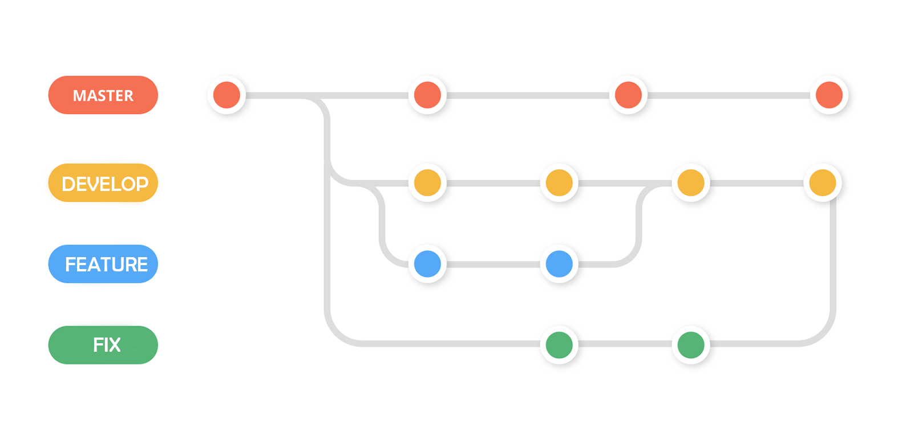

# Branches

A GitHub branch is used to work with different **versions** of a repository at the same time.

By default, a repository has a **master** branch (a production branch).

Any other branch is a **copy** of the master branch (as it was at a point in time).

New Branches are for bug fixes and feature work separate from the master branch. When changes are ready, they can be merged into the master branch. If you make changes to the master branch while working on a new branch, these updates can be pulled in.

